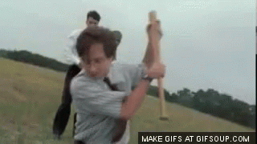

# Folium and Mapping with Python

---

# TL;DR

`folium` feels like the matplotlib of maps
- highly customizable
- highly frustrating to configure

Try `plotly` first, and fall back to `folium` if needed

---

# Installing

```bash
# Install folium and vega through conda-forge
conda install folium vega -c conda-forge
# Install altair to make sub-plots "easier"
conda intall altair
```

---

# Map of Mammel Hall!

```python
import folium

# start by creating a base map

m = folium.Map(location=[41.244177, -96.015444],
              zoom_start = 16)
```

---

# Add some helpful markers to the map!

```python
# Make a list of places to include in your map
markers = [
    folium.Marker(
    location=[41.244177, -96.015444],
    popup='Mammel Hall',
    icon=folium.Icon(color='red', icon='info-sign')
    ),
    folium.Marker(
    location=[41.247266, -96.016845],
    popup='Peter Kiewit Institute',
    icon=folium.Icon(color='red', icon='info-sign')
    ),
    
]

# Add those places to the map!
for i in markers: i.add_to(m)
```

---

# Adding figures as popups (but maybe don't...)

First, we need data:

```python
import pandas as pd

data = pd.read_csv("your/path/here/econ_tech.csv")
data.columns = ["Week", "Econ", "Tech"]
```
---

# Adding figures as popups (but maybe don't...)

Then we add our plots to an IFrame:

```python
import altair as alt
import branca

vis3 = alt.Chart(data, width=400).mark_line().encode(
    x='Week',
    y='Econ'
).to_html()

iframe = branca.element.IFrame(html=vis3, width=500, height=450)
vis3 = folium.Popup(iframe)

m = folium.Map([43, -100], zoom_start=4)

folium.Marker([30, -100], popup=vis3).add_to(m)

m
```

---

# Adding figures as popups (but maybe don't...)

Some thoughts:
- I tried SO many things to make this easier and look nicer
    - None of them worked
- None of the other advertised libraries were as well integrated as advertised
    - Tried Bokeh, Plotly, Altair (in several ways)

Maybe this is just one of the things I have to let go!

---

# Me letting go...



---

# Choropleths

Honestly, I ran out of time to figure out how to take their example code and modify it!

- Nothing made sense!
- The errors only pushed me further from an answer

---

# Quick pitch for Plotly maps

```python
# import plotly
import plotly.express as px

data = pd.read_csv("your/path/here/econ_tech_states.csv")

# Generate the map
px.choropleth(locations=data['state_code'], 
locationmode="USA-states", color=data['Econ'], scope="usa")
```

---

# Comparing

| Goal | `folium` | `plotly` |
| ---  | ----     | ---- |
| Create a map with points of interest| $\checkmark$ | |
| Create a choropleth/bubble map of the US/world| ~$\checkmark$ | $\checkmark$|
| Using custom GeoJSON to generate a map | ? | ~$\checkmark$ |
| Useable offline | | $\checkmark$ |
| Readable Documentation | | ~$\checkmark$ |
| Mapbox compatibility | $\checkmark$ | $\checkmark$ |

---

# Links to Documentation:

[Folium](https://python-visualization.github.io/folium/index.html)
[Plotly](https://plotly.com/python/)

---

# Thanks!